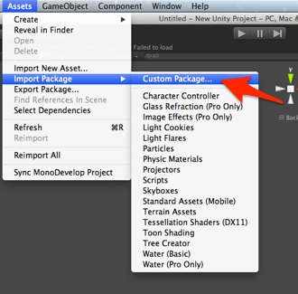
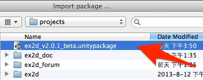
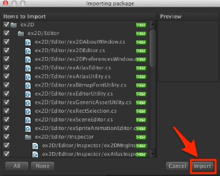
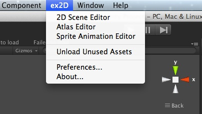

# Installation

This guide will quickly walk you through how to install ex2D into your project.

### Get the .unitypackage file

After you download the package zip file, extract the file into any folder you choose. You should be able to find
 a file named *ex2d_vXXX.unitypackage*. That's the package we'll import to your project later.

If you somehow get some randomly named folders instead, that's caused by your file decompressor over extracted the
 .unitypackage file. That happens often on a Mac with some file decompressor. If it happens, try to use Mac's native
 zip file decompressor or manually extract the file until you see the .unitypackage file.

### Import ex2D package

Open your Unity project, select "Assets -> Import Package -> Custom Package...".

Select the .unitypackage file and click __Open__ in the dialogue window.

### Confirm the Import

An import confirm window will pop up. Click __Import__ button to confirm importing ex2D package.

This will create a __ex2D__ folder with all the package files into the root of the __Assets__ folder of your project.

If the import is successful, you will be able to find a __ex2D__ menu in the Unity menu bar.

***

Next let's quickly walkthrough ex2D's working pipeline by reading [Quick Start][1].

[1]: ../quick-start/

